# Search_Engine_IR_System

One of the most important tool is search Engine which we used daily to make searches/ study....etc

### Note: that the system is still under Construction by Pro Devolpers

# ALL IR Algorithms

### Term Weights: Inverse Document Frequency

- 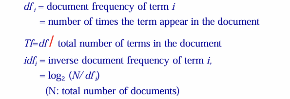

### TF-IDF Weighting

- 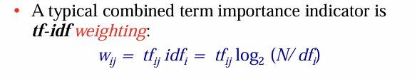

### Similarity Measure - Inner Product

- 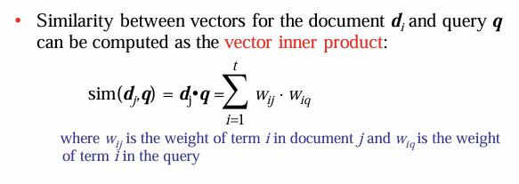

### Cosine Similarity Method

- 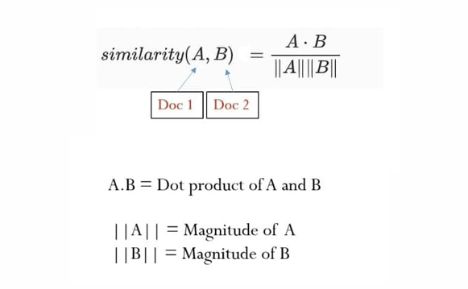

### Precision and Recall

- 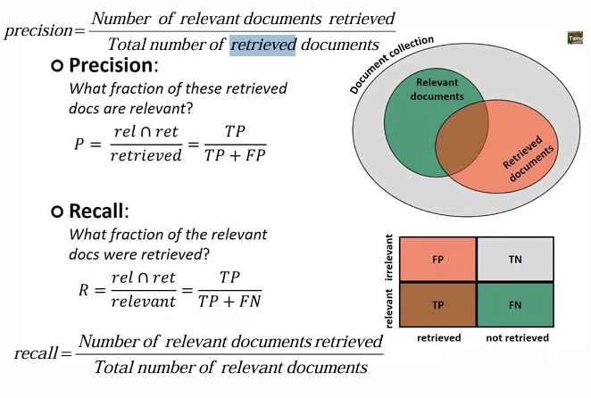

### F-Measure

- 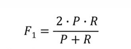

### E-Measure

- 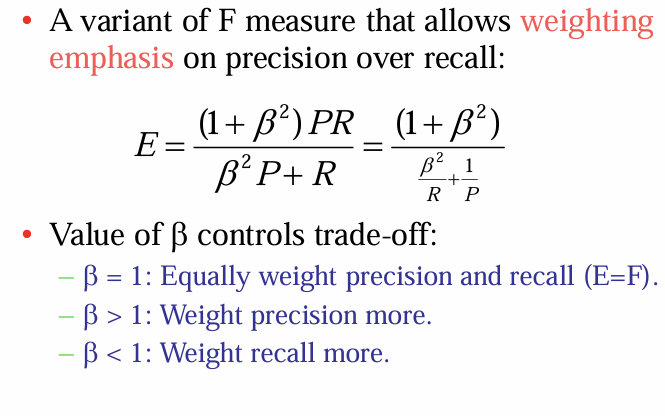

### Discounted Cumulative Gain (DCG)

- 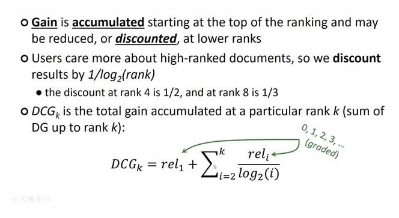

### Normalized Discounted Cumulative Gain (NDCG)

- 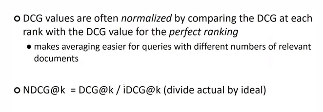

### RankPower

- 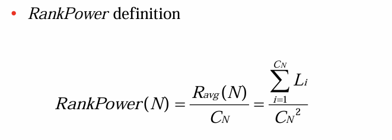

###  Jaccard Coefficient

- 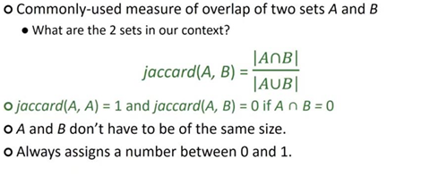

### Formulation of PRP

- 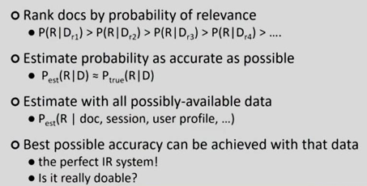

### Using language model (LM) in IR

- 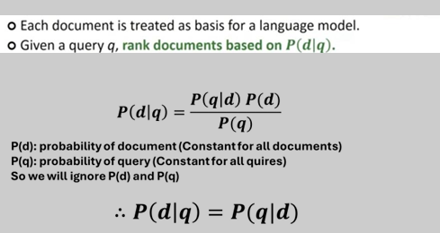

### Parameter Estimation

- 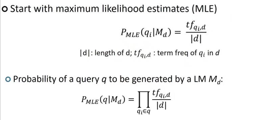

### Jelinek – Mercer Smoothing

- 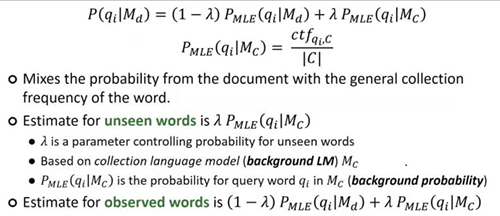
  
- 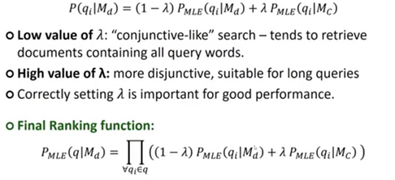
